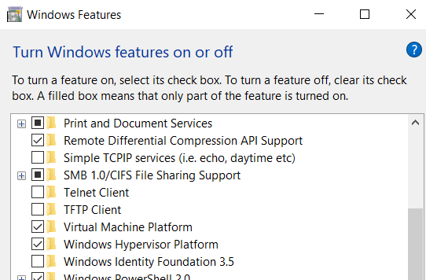

| INFO PROPERTY | VALUE                 |
| ------------- | --------------------- |
| Folder Name   | **arch-ehw-old-perl** |
| File Name     | README.md             |
| Date Created  | 05/27/25              |
| Date Modified | --                    |
| Version       | 00.00.01              |
| Programmer    | **Eric Hepperle**     |

### TECHNOLOGIES

 

## TAGS

`Library` `Personal Projects` `Eric Hepperle's Code` `Perl`

## Purpose

This is a collection of all my _**old Perl code**_. Since I've not really written much Perl since 2013, this code library is about 10 years old. I am using GIT to organize and standardize the code, documenting with markdown files DOCBlocks, etc.

Phase 1: Identify all my Perl code and group into folders

Phase 2: Test out the code to see what works and how well

Phase 3: Fix the broken parts

Not sure how long it will take, but every journey starts with a single step. Or, as Pastor Harvey always says "bit-by-bit".

---

## Change Notes

- [] Determine how to get Perl to work in VSCODE in 2025

---

# Installing & Configuring Perl on Windows 10 in 2025

1. [Install WSL](/#install-wsl)
2. Install Ubuntu from MS Store app
3. Install Perl on Ubuntu?
4. Install VSCODE on Ubuntu?

## Intall WSL

- 2 Best ways in 2025 to run Perl on Windows 10+ seem to be WSL or Strawberry Perl (What about Komodo IDE & ActivePerl? It's not some complex paid thing)
- #GOTCHA: WSL says `Wsl/Service/CreateInstance/CreateVm/HCS/HCS_E_HYPERV_NOT_INSTALLED`
- #SOLVED:  Ensure Windows Features: Hypervisor and Windows Subsystem for Linux are installed

- #GOTCHA: Now HyperV and WSL are installed, but only a black screen with blinking cursor comes up
- #SOLVED: Unfortunately, to run WSL on Win 10 you have to uninstall Docker Desktop - they don't seem to play well together. Also, it doesn't matter that you are not currently running Docker, it needs to be totally installed. Now I have the Ubuntu prompt and testing with `ps -aux` works.
- #POSSIBLE:  Maybe Docker Desktop simply needs to be turned off, but I already uninstalled it.

- In the Ubuntu CLI test that Perl is installed and working with this command `perl -e 'print "Hello World!\n\n"'`. It should print **"Hello World!** followed by a blank line.

---

## Resources:
  - https://learn.microsoft.com/en-us/answers/questions/1336873/how-to-solve-wsl-service-createinstance-createvm-h
  - https://github.com/microsoft/WSL/issues/11923
  - https://learn.microsoft.com/en-us/windows/wsl/troubleshooting#installation-issues